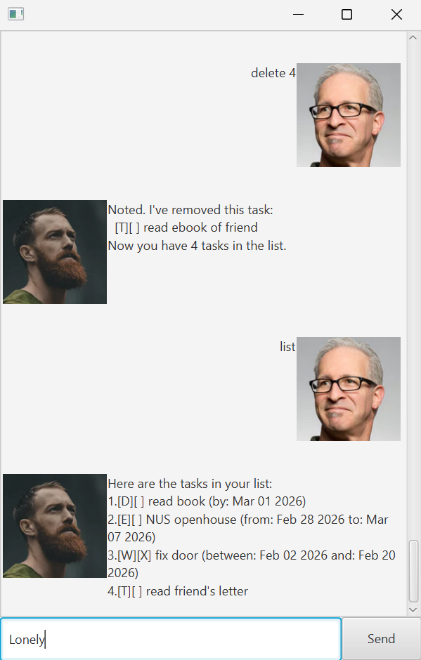

# Lonely User Guide


This is Lonely, a chatbot that allows you to store, manipulate and view your tasks.

## Features
### Note:
- you do not need to worry about saving tasks Lonely automatically saves when you enter "bye". HOWEVER closing lonely without "bye" the list will not be saved
- press Enter to submit commands
- when adding tasks with time(eg: deadline) use the "yyyy-MM-dd" format(eg:"1919-01-01")
- when using list command there are symbols displayed
```
([_]-> "_" is a placeholder)
  - [_][X] --> marked task
  - [_][ ] --> unmarked task
  - [D][_] --> deadline task
  - [W][_] --> dowithin task
  - [E][_] --> event task
  - [T][_] --> todo task
```
### Adding task deadlines
You can add a deadline for a task to be completed by.

Example: `deadline read book /by 2026-03-01`
```
Got it. I've added this task:
[D][ ] read book (by: Mar 01 2026)
Now you have 1 tasks in the list.
```
### Adding tasks as events
You can add a event task that occurs between many days.

Example: `event NUS openhouse /from 2026-02-28 /to 2026-03-07`
```
Got it. I've added this task:
[E][ ] NUS openhouse (from: Feb 28 2026 to: Mar 07 2026)
Now you have 2 tasks in the list.
```
### Adding tasks to do within time
You can add a task to do between a certain period

Example: `dowithin fix door /between 2026-02-02 /and 2026-02-20`
```
Got it. I've added this task:
[W][ ] fix door (between: Feb 02 2026 and: Feb 20 2026)
Now you have 3 tasks in the list.
```
### Adding tasks to do
You can add a task that you want to remember to do.

Example: `todo read ebook of friend`

Example: `todo read friend's letter`
```
Got it. I've added this task:
[T][ ] read ebook of friend
Now you have 4 tasks in the list.
Got it. I've added this task:
[T][ ] read friend's letter
Now you have 4 tasks in the list.
```

### Finding tasks
You can find a tasks that has a specific word or multiple words

Example: `find read book`
```
Here are the tasks in your list:
1.[D][ ] read book (by: Mar 01 2026)
2.[T][ ] read ebook of friend
```
### Marking tasks
You can mark a task a done by its index

Example: `mark 2`

Example: `mark 3`
```
Nice! I've marked this task as done:
[E][X] NUS openhouse (from: Feb 28 2026 to: Mar 07 2026)
Nice! I've marked this task as done:
[W][X] fix door (between: Feb 02 2026 and: Feb 20 2026)
```
### Unmarking tasks
You can unmark a task a done by its index

Example: `unmark 3`
```
OK, I've marked this task as not done yet:
[E][ ] NUS openhouse (from: Feb 28 2026 to: Mar 07 2026)
```
### Deleting tasks
You can delete a task you no longer want to track by its index

Example: `delete 4`
```
Noted. I've removed this task:
[T][ ] read ebook of friend
Now you have 4 tasks in the list.
```
### Listing out stored tasks
You can list out all tasks stored by Lonely

Example: `list`
```
Here are the tasks in your list:
1.[D][ ] read book (by: Mar 01 2026)
2.[E][ ] NUS openhouse (from: Feb 28 2026 to: Mar 07 2026)
3.[W][X] fix door (between: Feb 02 2026 and: Feb 20 2026)
4.[T][ ] read friend's letter
```
